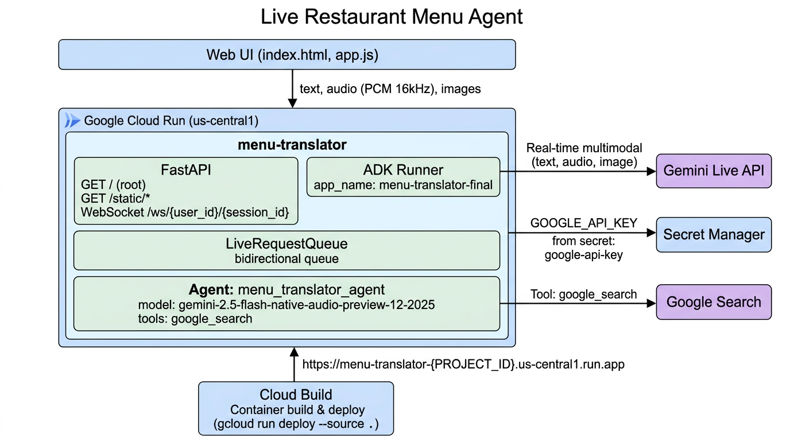

# Live Restaurant Menu Agent

A real-time voice and vision agent built for the **Gemini Live Agent Challenge 2026**. Uses Google's Agent Development Kit (ADK) and Gemini Live API for bidirectional streaming—supporting text, audio, and image input with natural barge-in (interrupt the agent mid-response).

---

## Quick Start (for Judges)

**Get running in ~3 minutes.** You need: Python 3.10+, a [Gemini API key](https://aistudio.google.com/apikey) (free), and either [uv](https://docs.astral.sh/uv/) or pip.

```bash
# 1. Clone and enter project
cd gemini-challenge-2026

# 2. Install dependencies (uv recommended; or: pip install -e .)
uv sync

# 3. Create app/.env with your API key
cp app/.env.template app/.env
# Edit app/.env: replace your_api_key_here with your key from aistudio.google.com/apikey

# 4. Run from app/ directory (required—Python imports depend on it)
cd app
uv run --project .. uvicorn main:app --reload --host 0.0.0.0 --port 8000
```

**5. Open** [http://localhost:8000](http://localhost:8000) in your browser.

**Success:** You should see the Live Restaurant Menu Agent UI with a text input and "Start Call" button. Type a message and click Send—you'll get streamed responses. Or click "Start Call" for voice. If responses appear, you're running correctly.

**Troubleshooting:** See the [Troubleshooting](#troubleshooting) section. Common fixes: SSL errors → `export SSL_CERT_FILE=$(uv run python -m certifi)`; `ModuleNotFoundError` → run from `app/` directory.

---

## Overview

This demo implements the complete ADK bidirectional streaming lifecycle:

1. **Application Initialization**: Creates `Agent`, `SessionService`, and `Runner` at startup
2. **Session Initialization**: Establishes `Session`, `RunConfig`, and `LiveRequestQueue` per connection
3. **Bidirectional Streaming**: Concurrent upstream (client → queue) and downstream (events → client) tasks
4. **Graceful Termination**: Proper cleanup of `LiveRequestQueue` and WebSocket connections

## Features

- **WebSocket Communication**: Real-time bidirectional streaming via `/ws/{user_id}/{session_id}`
- **Multimodal Requests**: Text, audio, and image/video input with automatic audio transcription
- **Flexible Responses**: Text or audio output, automatically determined based on model architecture
- **Session Resumption**: Reconnection support configured via `RunConfig`
- **Concurrent Tasks**: Separate upstream/downstream async tasks for optimal performance
- **Interactive UI**: Web interface with event console for monitoring Live API events
- **Google Search Integration**: Agent equipped with `google_search` tool

## Architecture

> **📋 For Judges (Devpost)**: The architecture diagram below shows how Gemini connects to our GCP backend at a glance. You can also find it in [`docs/architecture-diagram.png`](docs/architecture-diagram.png)—add it to your Devpost image carousel or file upload.



*Service: `menu-translator` | Agent: `menu_translator_agent` | Endpoints: `GET /`, `WebSocket /ws/{user_id}/{session_id}` | Secret: `google-api-key`*

The application follows ADK's recommended concurrent task pattern:

```
┌─────────────┐         ┌──────────────────┐         ┌─────────────┐
│             │         │                  │         │             │
│  WebSocket  │────────▶│ LiveRequestQueue │────────▶│  Live API   │
│   Client    │         │                  │         │   Session   │
│             │◀────────│   run_live()     │◀────────│             │
└─────────────┘         └──────────────────┘         └─────────────┘
  Upstream Task              Queue              Downstream Task
```

- **Upstream Task**: Receives WebSocket messages and forwards to `LiveRequestQueue`
- **Downstream Task**: Processes `run_live()` events and sends to WebSocket client

## Prerequisites

- **Python 3.10+**
- **Gemini API key** (free at [aistudio.google.com/apikey](https://aistudio.google.com/apikey)) or Vertex AI
- **uv** (recommended) or pip

**Install uv (one-liner):**

```bash
# macOS/Linux
curl -LsSf https://astral.sh/uv/install.sh | sh

# Windows
powershell -ExecutionPolicy ByPass -c "irm https://astral.sh/uv/install.ps1 | iex"
```

## Installation (Detailed)

### 1. Install Dependencies

From the project root:

```bash
uv sync
```

Or with pip: `python3 -m venv .venv && source .venv/bin/activate && pip install -e .`

### 2. Configure API Key

Copy the template and add your key:

```bash
cp app/.env.template app/.env
```

Edit `app/.env` and replace `your_api_key_here` with your key from [Google AI Studio](https://aistudio.google.com/apikey). The only required variable for local run is `GOOGLE_API_KEY`.

### 3. Run the Server

**Important:** You must run from the `app/` directory (Python imports require it).

```bash
cd app
uv run --project .. uvicorn main:app --reload --host 0.0.0.0 --port 8000
```

With pip (venv activated): `uvicorn main:app --reload --host 0.0.0.0 --port 8000`

### 4. Open the App

Go to [http://localhost:8000](http://localhost:8000). You should see the Live Restaurant Menu Agent UI.

**Optional—SSL errors?** Run `export SSL_CERT_FILE=$(uv run python -m certifi)` before starting the server.

**Vertex AI instead of Gemini API?** Set `GOOGLE_GENAI_USE_VERTEXAI=TRUE` in `.env`, add `GOOGLE_CLOUD_PROJECT` and `GOOGLE_CLOUD_LOCATION`, and run `gcloud auth application-default login`.

#### Background Mode

```bash
cd app
uv run --project .. uvicorn main:app --host 0.0.0.0 --port 8000 > server.log 2>&1 &
tail -f server.log   # View logs
kill $(lsof -ti:8000)  # Stop server
```

## Usage

### Text Mode

1. Type your message in the input field
2. Click "Send" or press Enter
3. Watch the event console for Live API events
4. Receive streamed responses in real-time

### Audio Mode

1. Click "Start Call" to begin voice interaction
2. Speak into your microphone
3. Receive audio responses with real-time transcription
4. Click "Stop Audio" to end the audio session

## WebSocket API

### Endpoint

```
ws://localhost:8000/ws/{user_id}/{session_id}
```

**Path Parameters:**
- `user_id`: Unique identifier for the user
- `session_id`: Unique identifier for the session

**Response Modality:**
- Automatically determined based on model architecture
- Native audio models use AUDIO response modality
- Half-cascade models use TEXT response modality

### Message Format

**Client → Server (Text):**
```json
{
  "type": "text",
  "text": "Your message here"
}
```

**Client → Server (Image):**
```json
{
  "type": "image",
  "data": "base64_encoded_image_data",
  "mimeType": "image/jpeg"
}
```

**Client → Server (Audio):**
- Send raw binary frames (PCM audio, 16kHz, 16-bit)

**Server → Client:**
- JSON-encoded ADK `Event` objects
- See [ADK Events Documentation](https://google.github.io/adk-docs/) for event schemas

## Project Structure

```
gemini-challenge-2026/
├── app/
│   ├── menu_translator_final/   # Agent definition module
│   │   ├── __init__.py          # Package exports
│   │   └── agent.py             # Agent configuration
│   ├── main.py                  # FastAPI application and WebSocket endpoint
│   ├── .env                     # Environment configuration (not in git)
│   ├── .env.template            # Env var template (no secrets)
│   └── static/                  # Frontend files
│       ├── index.html           # Main UI
│       ├── css/
│       │   └── style.css        # Styling
│       └── js/
│           ├── app.js                   # Main application logic
│           ├── audio-player.js          # Audio playback
│           ├── audio-recorder.js        # Audio recording
│           ├── pcm-player-processor.js  # Audio processing
│           └── pcm-recorder-processor.js # Audio processing
├── docs/
│   ├── architecture-diagram.png  # Architecture diagram (for Devpost carousel)
│   └── GIT_GUIDE.md              # Git setup and ongoing workflow reference
├── scripts/
│   └── deploy.sh               # Cloud Run deploy script
├── Dockerfile                  # Container build for Cloud Run
├── pyproject.toml              # Python project configuration
└── README.md                   # This file
```

## Code Overview

### Agent Definition (app/menu_translator_final/agent.py)

The agent is defined in a separate module following ADK best practices:

```python
agent = Agent(
    name="menu_translator_agent",
    model=os.getenv("AGENT_MODEL", "gemini-2.5-flash-native-audio-preview-12-2025"),
    tools=[google_search],
    instruction=AGENT_INSTRUCTION  # Barge-in, menu vision, brevity
)
```

### Application Initialization (app/main.py)

```python
from menu_translator_final.agent import agent

app = FastAPI()
session_service = InMemorySessionService()
runner = Runner(app_name="menu-translator-final", agent=agent, session_service=session_service)
```

### WebSocket Handler (app/main.py)

The WebSocket endpoint implements the complete bidirectional streaming pattern:

1. **Accept Connection**: Establish WebSocket connection
2. **Configure Session**: Create `RunConfig` with automatic modality detection
3. **Initialize Queue**: Create `LiveRequestQueue` for message passing
4. **Start Concurrent Tasks**: Launch upstream and downstream tasks
5. **Handle Cleanup**: Close queue in `finally` block

### Concurrent Tasks

**Upstream Task** (app/main.py:125-172):
- Receives WebSocket messages (text, image, or audio binary)
- Converts to ADK format (`Content` or `Blob`)
- Sends to `LiveRequestQueue` via `send_content()` or `send_realtime()`

**Downstream Task** (app/main.py:174-187):
- Calls `runner.run_live()` with queue and config
- Receives `Event` stream from Live API
- Serializes events to JSON and sends to WebSocket

## Configuration

### Supported Models

The demo supports any Gemini model compatible with Live API:

**Native Audio Models** (recommended for voice):
- `gemini-2.5-flash-native-audio-preview-12-2025` (Gemini Live API)
- `gemini-live-2.5-flash-native-audio` (Vertex AI)

Set the model via `AGENT_MODEL` in `.env` or modify `app/menu_translator_final/agent.py`.

For the latest model availability and features:
- **Gemini Live API**: Check the [official Gemini API models documentation](https://ai.google.dev/gemini-api/docs/models)
- **Vertex AI Live API**: Check the [official Vertex AI models documentation](https://cloud.google.com/vertex-ai/generative-ai/docs/learn/models)

### RunConfig Options

The demo automatically configures bidirectional streaming based on model architecture (app/main.py:76-104):

**For Native Audio Models** (containing "native-audio" in model name):
```python
run_config = RunConfig(
    streaming_mode=StreamingMode.BIDI,
    response_modalities=["AUDIO"],
    input_audio_transcription=types.AudioTranscriptionConfig(),
    output_audio_transcription=types.AudioTranscriptionConfig(),
    session_resumption=types.SessionResumptionConfig()
)
```

**For Half-Cascade Models** (other models):
```python
run_config = RunConfig(
    streaming_mode=StreamingMode.BIDI,
    response_modalities=["TEXT"],
    input_audio_transcription=None,
    output_audio_transcription=None,
    session_resumption=types.SessionResumptionConfig()
)
```

The modality detection is automatic based on the model name. Native audio models use AUDIO response modality with transcription enabled, while half-cascade models use TEXT response modality for better performance.

## Troubleshooting

### "ModuleNotFoundError: No module named 'menu_translator_final'"

**Cause:** Server was started from the project root instead of `app/`.

**Fix:** Always run uvicorn from inside `app/`:
```bash
cd app
uv run --project .. uvicorn main:app --reload --host 0.0.0.0 --port 8000
```

### WebSocket fails to connect

- Verify `GOOGLE_API_KEY` in `app/.env` is set and valid
- Check terminal for error messages
- Ensure uvicorn is running on port 8000

### SSL / certificate errors

```bash
export SSL_CERT_FILE=$(uv run python -m certifi)
```
Then restart the server.

### Audio not working

- Grant microphone permissions in the browser
- Use a modern browser (Chrome recommended)
- Ensure `AGENT_MODEL` in `.env` includes `native-audio` for voice I/O

### "Model not found" or quota errors

- Confirm your API key is valid at [aistudio.google.com](https://aistudio.google.com)
- Check API quota in Google AI Studio
- For Vertex AI: enable billing and Vertex AI API

## Development

### Code Formatting

This project uses black, isort, and flake8 for code formatting and linting. Configuration is inherited from the repository root.

**Using uv:**

```bash
uv run black .
uv run isort .
uv run flake8 .
```

**Using pip (with activated venv):**

```bash
black .
isort .
flake8 .
```

To check formatting without making changes:

```bash
# Using uv
uv run black --check .
uv run isort --check .

# Using pip
black --check .
isort --check .
```

## Additional Resources

- **ADK Documentation**: https://google.github.io/adk-docs/
- **Gemini Live API**: https://ai.google.dev/gemini-api/docs/live
- **Vertex AI Live API**: https://cloud.google.com/vertex-ai/generative-ai/docs/live-api
- **ADK GitHub Repository**: https://github.com/google/adk-python

## License

Apache 2.0 - See repository LICENSE file for details.
